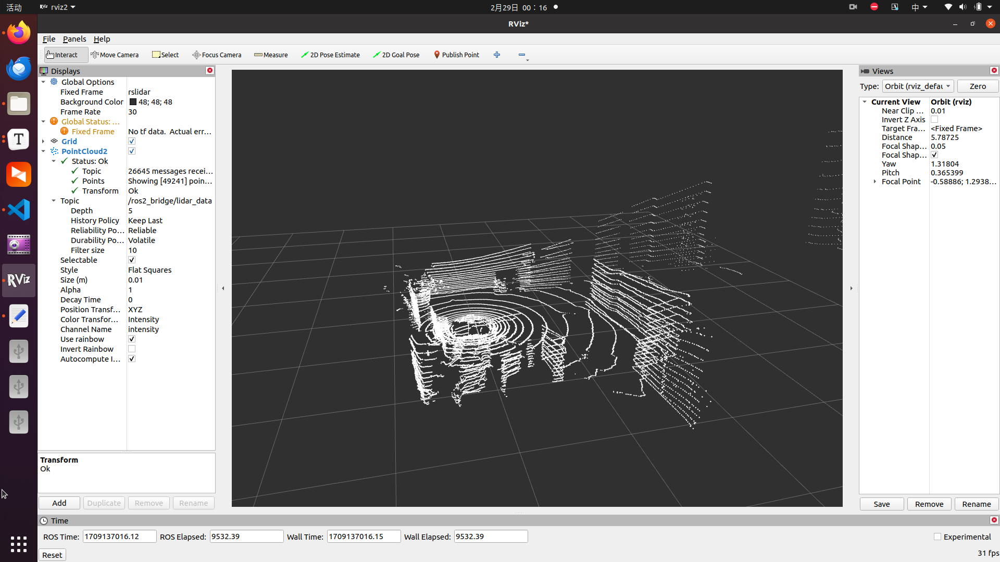

# RSlidar_driver for DORA

## files

lidar.pcap:激光雷达数据包

rs_driver:雷达驱动包

rslidar_driver_pcap.cc: C++读取pcap点云数据包

rslidar_driver.cc: 雷达传感器C++驱动代码

rslidar_driver_ros.cc: C++发送到ros2显示点云的代码

Dora版本 0.3.6

  
## usage

step1: install rslidar driver

```bash
sudo apt-get install libpcap-dev libeigen3-dev libboost-dev libpcl-dev
cd rs_driver
mkdir build && cd build
cmake .. && make -j4
```

step2: build rslidar dora node


```bash
cd file_path/lidar
mkdir build && cd build
cmake ..
make
```


step3 run rslidar DORA node

```bash
dora start dataflow_rslidar.yml --name test
```
 
then open anthor terminator and input

```bash
rviz2
```

可以通过param/config.yaml文件修改激光雷达的配置参数适配不同的速腾激光雷达


可以在ros2看见话题： *ros2_bridge/lidar_data*,启动Rviz2，通过话题添加PointCloud2可以显示激光雷达数据。



